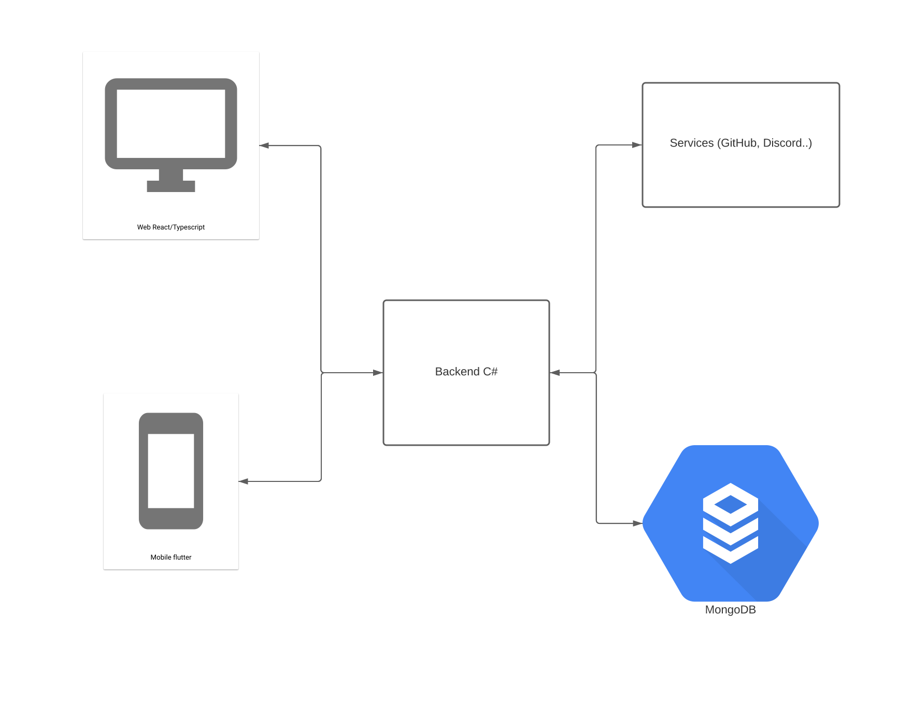
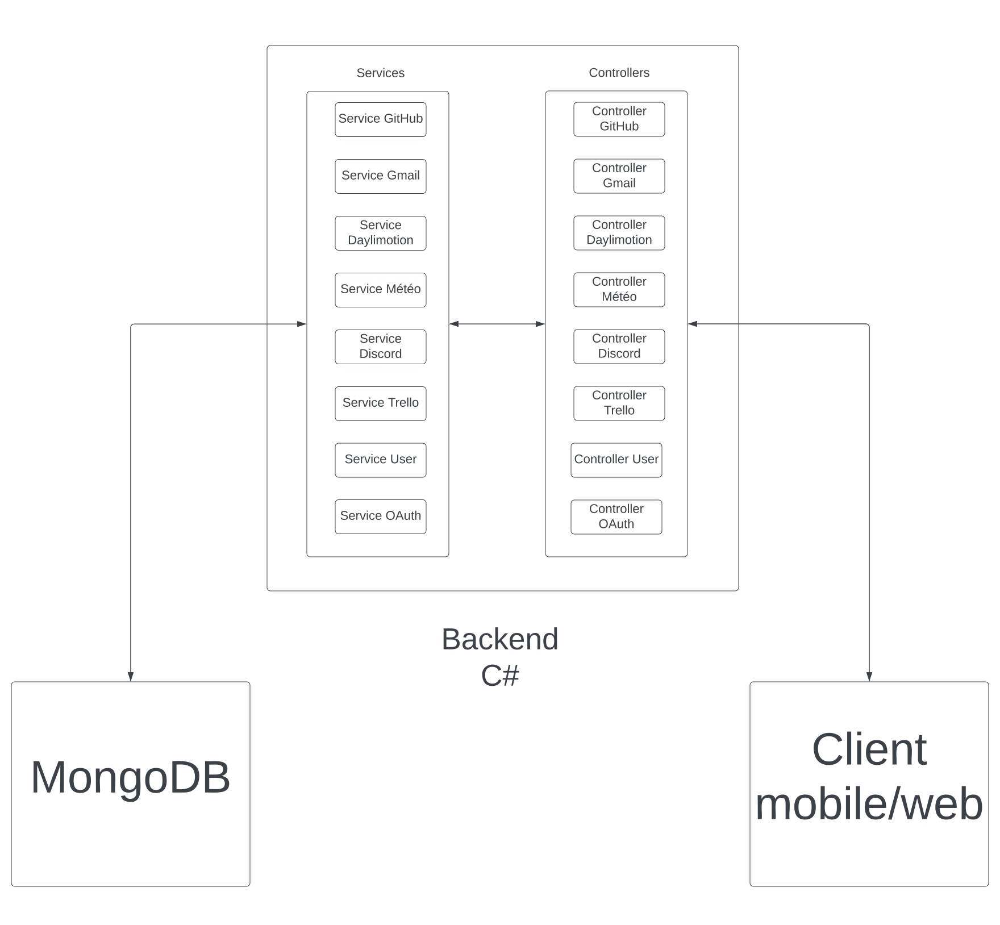
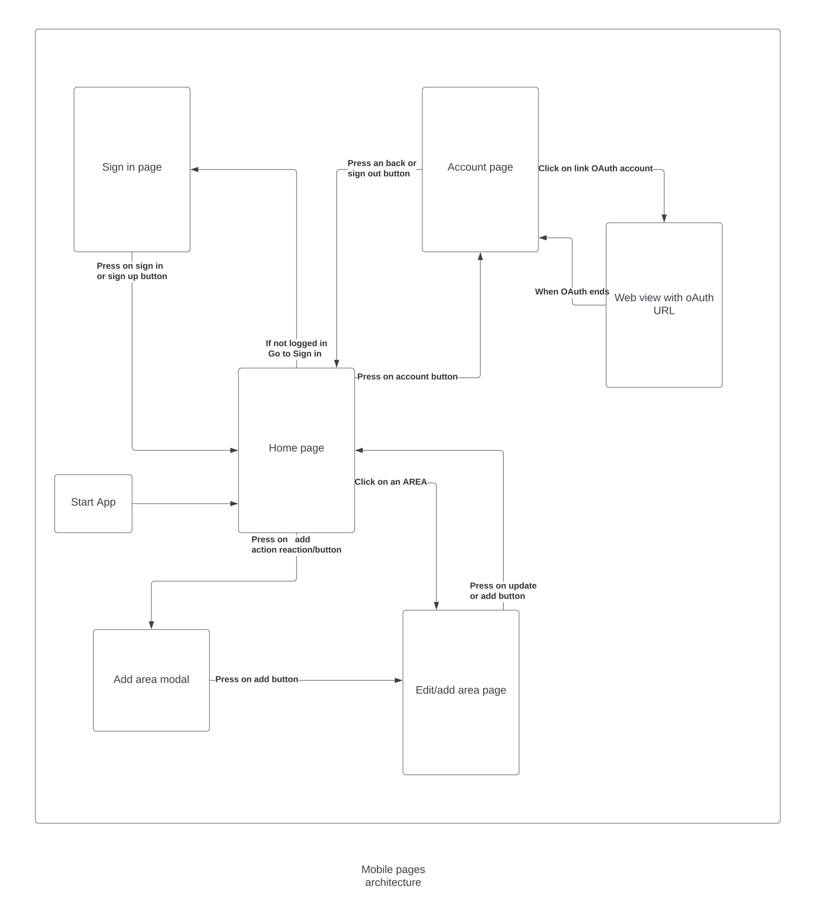

# Area
### Epitech End Year Project in Tek3

## Team

|  |  |  |  |  |
|:-----------------------------------------------------------------------------------------:|:-------------------------------------------------------------------------------------:|:---------------------------------------------------------------------------------------------:|:-------------------------------------------------------------------------------------------:|:-----------------------------------------------------------------------------------------:|
|                 <a href="https://github.com/pjeannin">Pierre Jeannin</a>                  |                  <a href="https://github.com/y4nn96E">Yann Simon</a>                  |               <a href="https://github.com/ForsterFrederic">Frédéric Forster</a>               |                   <a href="https://github.com/KillianPIN">Killian Pin</a>                   |                <a href="https://github.com/antonyftp">Antony Fantapié</a>                 |
|                                     Mobile developper                                     |                                  Backend developper                                   |                                        Web developper                                         |                                     Backend developper                                      |                                          DevOps                                           |

##  Project Description
The goal of this project is to create a website and a mobile application that will allow the user to create Actions and Reaction. Like IFTTT for example. There are different services available in our application. The user choose an action in a service and a reaction in another (or in the same) service and when the action is triggered, the reaction will be executed. Let's make an example:

- The user choose to create an action in the **Github** service. The action will be: **When a new repository is created**.
- The user choose to create a reaction in the **Trello** service. The reaction will be: **Create a new Card**.

When the action is triggered, the reaction will be executed. Sometimes, variables can be passed from the action to the reaction (for example, the author of the commit).

## Run the project in local

All the project is dockerized. To build and run the project in local you need to have an env directory which contains the following files:

- **mongodb.env**:
  - MONGO_INITDB_ROOT_USERNAME=root
  - MONGO_INITDB_ROOT_PASSWORD=*your mongodb password*
- **mobile.env**:
  - BASE_URL=*the base url of the server*

For the server, you need to modify the server/appsettings.Production.json with the following values:

    {
        "DatabaseSettings": {
            "ConnectionString": "*your mongodb connection string*"
            "DatabaseName": "AreaDatabase"
        },
        "WebhooksSettings": {
            "ServerBaseUrl": "*the base url of the server*"
        }
    }

If you want to use your own API keys for services, you can add them in the server/appsettings.json file:

    {
        "Logging": {
            "LogLevel": {
                "Default": "Information",
                "Microsoft.AspNetCore": "Warning"
            }
        },
        "AllowedHosts": "*",
        "OAuth": {
            "Github": {
                "ClientID": "*your github client id*",
                "ClientSecret": "*your github client secret*"
            },
            "Google": {
                "ClientID": "*your google client id*",
                "ClientSecret": "*your google client secret*"
            },
            "Trello": {
                "ClientID": "*your trello client id*",
                "ClientSecret": "*your trello client secret*"
            }
        },
        "Weather": {
            "ApiKey": "*your www.weatherapi.com api key*"
        },
        "JwtKey": "slonectahujqebgmzdjyssfzvttalzmeybragnzxdtvxkxzqonnojqbzcnudurtlrtsvervrarbveayagkhbxjzlumawlduwwteppwfiixqgsgmfngpngqhdzdcicsxb"
    }

If you run the project locally, don't forget to use an ssh proxy to connect to the server, without it webhooks won't work.

Look at this to create ssh proxy : [localhost run](https://localhost.run)

For the web application, you need to create a web/src/.env file with the following values:

    BASE_URL=*the base url of the server*

Then you can run the following command (It will also run the dataseeder that will erase the existing database and add the services in the right collection):

    docker-compose build && docker-compose up -d

You can also run the project in local with the scripts 'deploy_with_data_seeder.sh' and 'deploy_without_data_seeder.sh'.

## Services

### Github

#### Actions

- When a push is made to a certain repository
- When a pull request is made to a certain repository
- When a workflow is triggered on a certain repository

#### Reactions

- Create a new issue on a certain repository
- Create a new pull request on a certain repository

### Gmail

#### Actions

- When a new email is received

#### Reactions

- Send an email

### Youtube

#### Actions

- When a video is published

#### Reactions

- Like a video

### Weather

#### Actions

- When the temperature is below a certain value
- When the weather is rainy
- When the Air Quality Index is below a certain value
- When the cloud cover is below a certain value
- When the wind speed is below a certain value
- When the rain percentage is below a certain value

### Trello

#### Actions

- When a card is added or deleted from a list

#### Reactions

- Create a new board
- Create a new list
- Create a new card

### Pornhub

#### Actions

- When a pornstar post a video

## Project architecture

### Server

The server is a simple REST API that will allow the web and mobile client to sign up/sign in and create actions and reactions. The server is also in charge of triggering actions and executing reactions. The server is written in **C#** with a **Mongo DB** database and hosted on Digital Ocean. It's available on the following address: [http://165.232.68.134:8080](http://165.232.68.134:8080).

### Web Application

The web application allow the user to sing up/sign in, create actions and reactions, see the list of actions and reactions, see the list of services and see the list of actions and reactions of a service. This web application is written in **React** and hosted on Digital Ocean. It's available on the following address: [http://165.232.68.134:8081](http://165.232.68.134:8081).
(As the web application can be run from different IP addresses, you may have to replace the base URL with the IP address of your server for OAuth Callback)

### Mobile Application

The mobile application as the same features as the web application. The mobile application is written in **Flutter** and hosted on Digital Ocean. The android version can be downloaded on the following address: [http://165.232.68.134:8081/client.apk](http://165.232.68.134:8081/client.apk).
(In this application, the user can change the backend endpoint while running the application by clicking the wheel icon on the login page or in the account page when the user is logged)

## API documentation

### Authentication

*POST /Authentication/register*

    body:

    {
        "name": "*username*",
        "email": "*email*",
        "password": "*password*"
    }

    headers:

    {
        "Content-Type": "application/json"
    }

*POST /Authentication/login*

body:

    {
        "email": "*email*",
        "password": "*password*"
    }

    headers:

    {
        "Content-Type": "application/json"
    }

*POST /Authentication/loginWithGoogle*

    body:

    {
        "email": "*email*",
        "name": "*name*",
        "access_token": "*token*"
    }

    headers:

    {
        "Content-Type": "application/json"
    }

### OAuth

*GET /OAuth/getGithubAuthorizeUrl*

    headers:

    {
        "Content-Type": "application/json"
        "Authorization": "Bearer *token*"
    }

*POST /OAuth/getGithubAccessToken*

    headers:

    {
        "Content-Type": "application/json"
        "Authorization": "Bearer *token*"
    }

    body:

    {
        "code": "*code*"
    }

*GET /OAuth/getGoogleCredentials*

    headers:

    {
        "Content-Type": "application/json"
    }

*POST /OAuth/storeGoogleAccessToken*

    headers:

    {
        "Content-Type": "application/json"
        "Authorization": "Bearer *token*"
    }

    body:

    {
        "access_token": "*token*"
    }

### Services

*Get /about.json*

    headers:

    {
        "Content-Type": "application/json"
    }

### User

*GET /User/getUser*

    headers:

    {
        "Content-Type": "application/json"
        "Authorization": "Bearer *token*"
    }

*POST /User/addActionService*

    headers:

    {
        "Content-Type": "application/json"
        "Authorization": "Bearer *token*"
    }

    body:

    {
        "name": "*action/reaction name*",
        "actionService": "*action service*",
        "action": "*action*",
        "reactionService": "*reaction service*",
        "reaction": "*reaction*"
        "paramsAction": {
            "*param name*: "*param value*
        }
        "paramsReaction": {
            "*param name*: "*param value*
        }
    }

*POST /User/removeActionService*

    headers:

    {
        "Content-Type": "application/json"
        "Authorization": "Bearer *token*"
    }

    body:

    {
      "actionReactionId": "*action/reaction id*"
    }

*POST /User/updateActionService*

    headers:

    {
        "Content-Type": "application/json"
        "Authorization": "Bearer *token*"
    }

    body:

    {
        "actionReactionId": "*action/reaction id*",
        "name": "*action/reaction name*",
        "paramsAction": {
            "*param name*: "*param value*
        }
        "paramsReaction": {
            "*param name*: "*param value*
        }
    }
